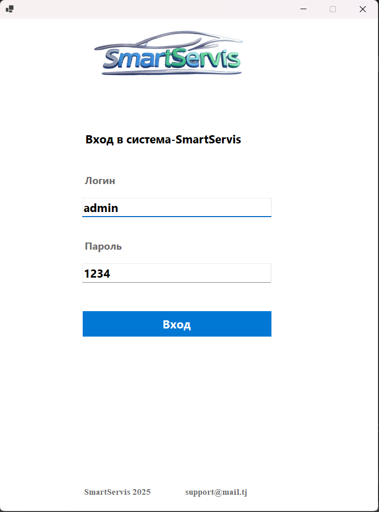
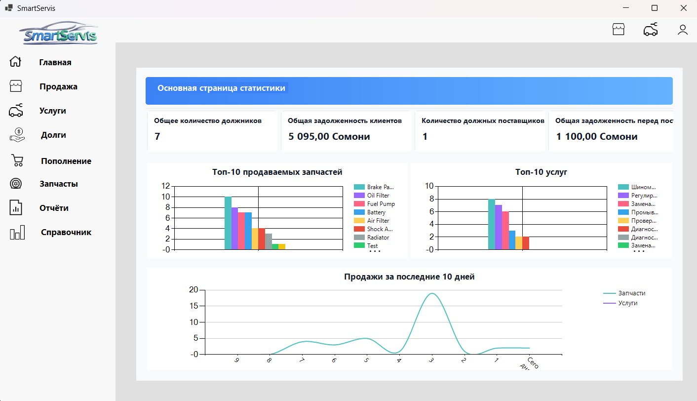
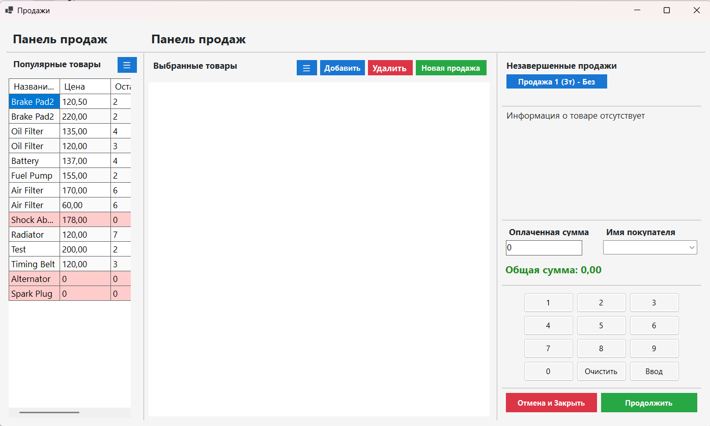
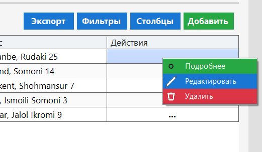
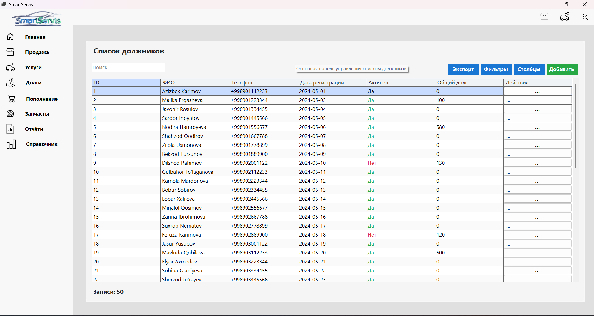
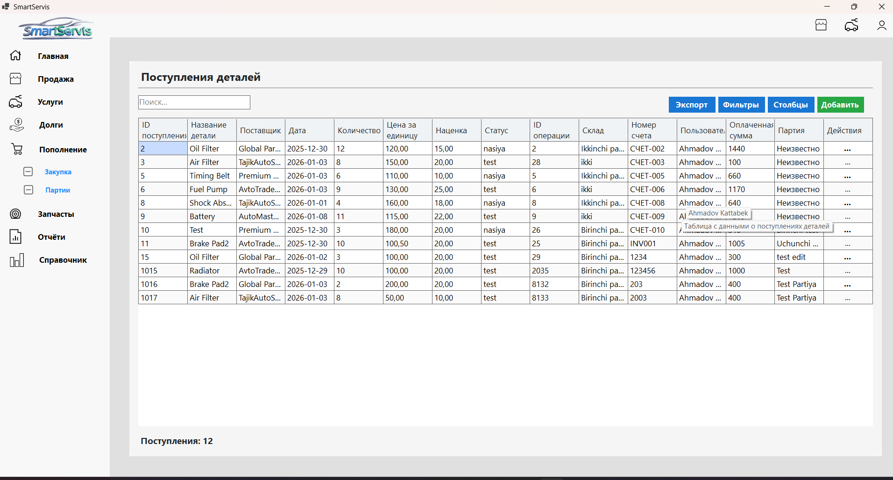
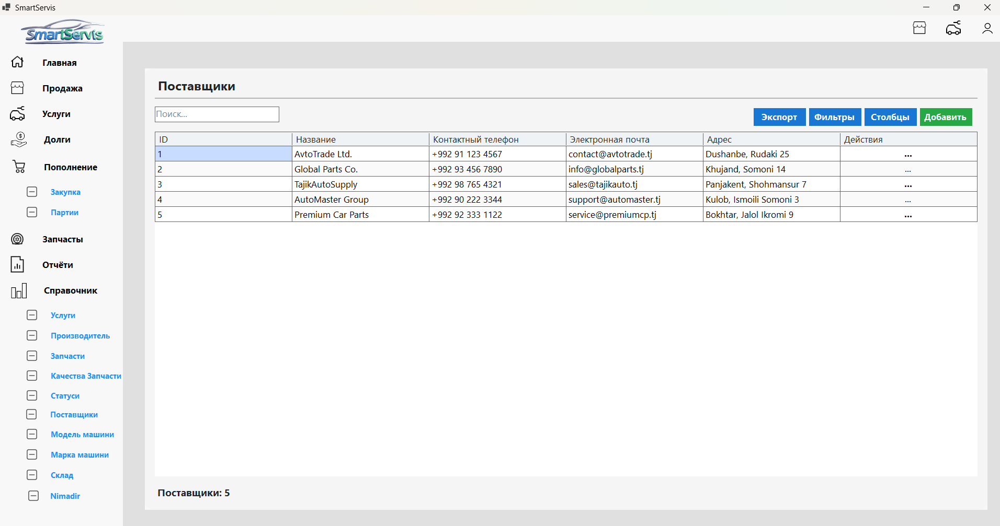
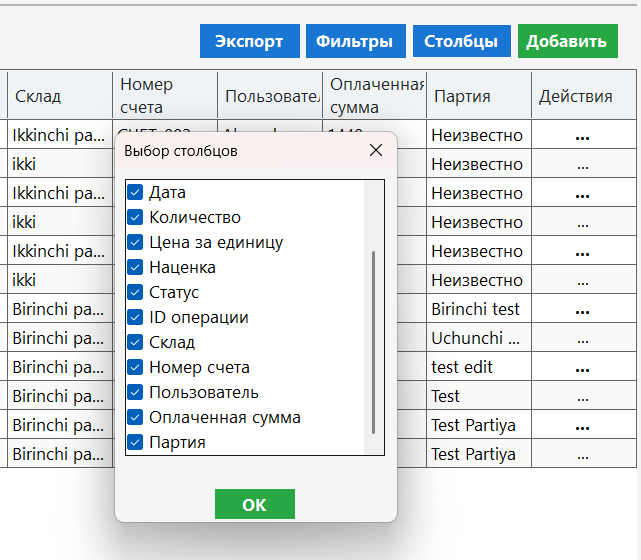
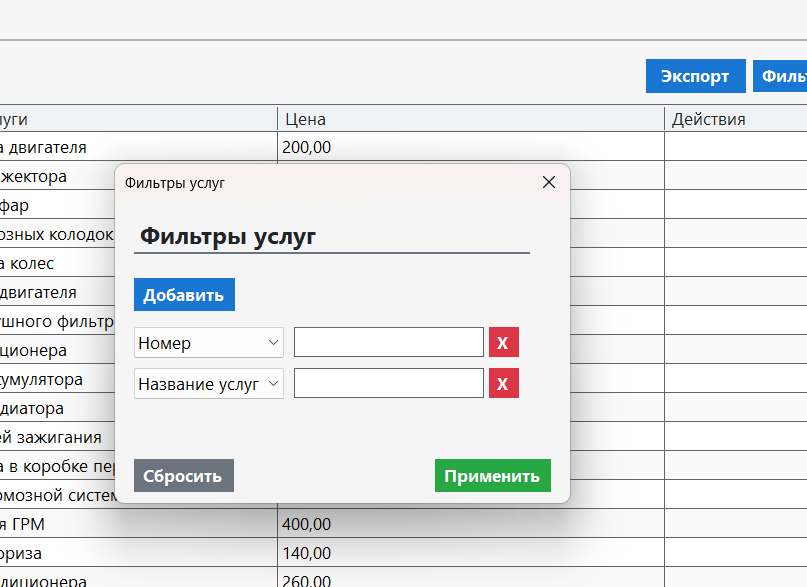
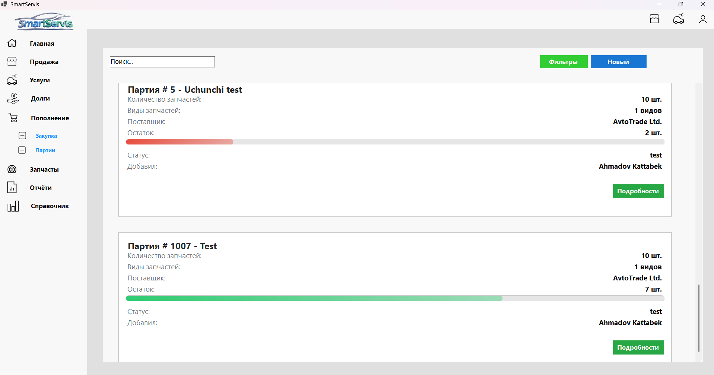

# 🚗 SmartServic – Auto Service Management System (WinForms)

## 📌 Overview

**SmartServic** is a modern Windows desktop application designed to fully manage automobile service centers. The system covers warehouse management, spare parts and products, service operations, customer and vehicle management, suppliers, financial flows, and analytics.

The application is built using **WinForms** with a **modern UI design** and follows the **MVVM architectural pattern**, ensuring clean separation of logic, maintainability, and scalability. SmartServic focuses on real business workflows used in auto service centers and repair shops.

---

## 🎯 Key Features

* Full auto service business management in one system
* Warehouse (stock) and spare parts management
* Product and service sales interface
* Customer and vehicle database
* Customer debt tracking
* Supplier (vendor) management
* Financial operations (income, expenses)
* Detailed statistics and dashboards
* Flexible reference data (spravochniki) management
* Import & Export to Excel in all modules
* Dynamic column visibility management
* Advanced dynamic filtering for every table
* Modern and user-friendly desktop UI

---

## 🧩 Technology & Architecture

### 🔹 Platform

* Windows Forms (WinForms)
* .NET (C#)
* Modern custom UI components

### 🔹 Architecture

* MVVM (Model–View–ViewModel)
* Clear separation of UI, business logic, and data
* Reusable components and services

### 🔹 Data & Utilities

* Database-driven system
* Excel Import / Export in all modules
* Dynamic data grids with configurable columns

---

## 🏭 Core Business Modules

### 🔧 Service Management

* Register vehicle service operations
* Manage service workflow and statuses
* Link services to customers and vehicles
* Track service history

### 📦 Warehouse & Spare Parts

* Manage spare parts and products stock
* Track incoming and outgoing items
* Supplier-linked inventory operations
* Real-time stock balance control

### 🛒 Sales (Products & Services)

* Convenient sales screen for products and services
* Fast item selection and pricing
* Integration with warehouse and service modules

### 👥 Customers & Vehicles

* Customer (client) database management
* Manage vehicles linked to each customer
* Track customer balances and debts
* Full service and sales history per customer

### 🚚 Suppliers (Postavshiki)

* Supplier database management
* Track purchases and supply history
* Integration with warehouse operations

### 📊 Finance & Analytics

* Income and expense tracking
* Business performance dashboards
* Statistical views for decision-making

---

## 📁 Project Structure (Logical)

```
SmartServic/
│
├── Views/
├── ViewModels/
├── Models/
├── Services/
├── Data/
├── Reports/
├── Exports/
├── Imports/
├── screenshots/
│   └── *.png
│
└── README.md
```

---

## 🖼 Screenshots & Feature Walkthrough

Below are real screenshots from the **SmartServic** application. All images are located in the **`screenshots/`** folder.

---

### 1️⃣ Authentication – Login Screen

**File:** `screenshots/login.png`



* Secure application entry
* Clean and minimal login interface
* Role-based access foundation

---

### 2️⃣ Dashboard – Business Overview

**File:** `screenshots/dashboard.png`



* Central dashboard with key business metrics
* Quick access to core modules
* Visual representation of system state

---

### 3️⃣ Sales Screen (Products & Services)

**File:** `screenshots/seelingscreen.png`



* Optimized interface for selling products and services
* Fast workflow for service centers
* Integrated with warehouse and finance modules

---

### 4️⃣ Warehouse / Stock Management

**File:** `screenshots/actions.png`



* Stock operations (add, remove, transfer)
* Real-time warehouse updates
* Supplier-linked inventory actions

---

### 5️⃣ Add / Register Operations

**File:** `screenshots/adding.png`


* Unified add/edit forms across the system
* Input validation and consistency
* User-friendly data entry

---

### 6️⃣ Customers & Vehicles

**File:** `screenshots/borrowers.png`



* Customer database management
* Linked vehicles per customer
* Customer debt tracking

---

### 7️⃣ Financial Income Management

**File:** `screenshots/incomes.png`



* Track income operations
* Financial transparency
* Integration with sales and services

---

### 8️⃣ Suppliers & Reference Data

**File:** `screenshots/spravochniki.png`



* Manage reference data (spravochniki)
* Centralized configuration for the system
* Used across all modules

---

### 9️⃣ Column Visibility Management

**File:** `screenshots/columns.png`



* Choose which table columns to display
* Personalized data views per user
* Available in all data tables

---

### 🔟 Dynamic Filtering System

**File:** `screenshots/dinamik_filter.png`



* Create dynamic filters for any column
* Advanced data search and analysis
* Consistent filtering experience across all modules

---

### 1️⃣1️⃣ Parties / Transactions

**File:** `screenshots/partiya.png`



* Manage grouped operations and transactions
* Improves traceability of business actions

---

## 📊 Import & Export

* Excel import supported in all main modules
* Export any table or report to Excel
* Used for reporting, backup, and external analysis

---

## 🧠 Why This Project Matters

This project demonstrates:

* Advanced WinForms desktop application development
* MVVM architecture in a real desktop system
* Complex business logic implementation
* Rich UI/UX for enterprise desktop software
* Data-intensive system design

Suitable as:

* A **strong portfolio desktop application**
* A **real auto service business solution**
* A **reference WinForms + MVVM project**

---

## 👨‍💻 Author

**Bek (Kattabek Ahmadov)**
Full Stack .NET Software Engineer

---

## 📜 License

This project is intended for educational and demonstration purposes.

---

⭐ If you find this project valuable, feel free to star the repository!
